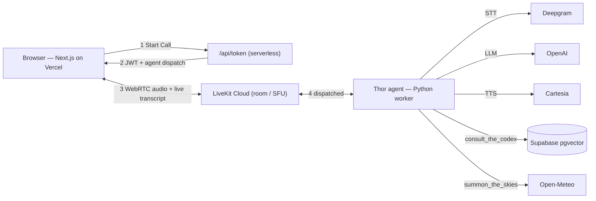

# ⚡ Midgard Kitchen

A **RAG-enabled voice agent** that tackles a real personal problem — eating well on **whole, real food** to stay strong — by handing it to someone who takes it seriously: **Thor, God of Thunder**, who must keep his warrior's physique even in mortal life. Open the app, hit **Start Call**, and ask him what to eat; he consults an ancient tome — **the Codex of Midgardian Sustenance** (Mrs. Beeton's *Book of Household Management*, 1861) — via retrieval-augmented generation, or reads the skies over your city to suggest fare that fits the day.

- 🔗 **Live demo:** **https://midgard-kitchen.vercel.app/**
- 🔑 **Access rune:** a shared code gates the public demo against random traffic — provided on request.
- 🎥 **5-min walkthrough:** **https://youtu.be/UDJmW_XgXeE**

---

## What it does

- Real-time **voice conversation** in the browser (WebRTC) with a **live transcript**.
- **RAG over a large public-domain PDF** — ask about a specific fact in a specific chapter and Thor retrieves it.
- **Two tool calls:** a RAG "consult the Codex" tool, and a live-weather "read the skies" tool that fits the narrative.
- A distinctive character with a strong, consistent voice, woven through every layer of the app.

## How it works (end-to-end)



1. The browser calls a **Next.js serverless token endpoint** (`/api/token`) that mints a short-lived, room-scoped JWT and attaches an **explicit agent-dispatch** config. The API secret never leaves the server; the browser only ever receives the token + server URL.
2. The client joins a **LiveKit Cloud** room; LiveKit dispatches the **Thor agent** into it.
3. The agent runs a **configurable STT–LLM–TTS pipeline** (Deepgram → OpenAI → Cartesia) with Silero VAD and LiveKit's audio turn detector for natural turn-taking and interruptions.
4. When Thor needs a fact or recipe the LLM calls **`consult_the_codex`** (RAG); when asked about weather or what to cook it calls **`summon_the_skies`** (live weather).
5. Transcriptions of both speakers stream back to the browser in real time.

## How RAG was integrated

- **Source:** Mrs. Beeton's *Book of Household Management*, Vol. 1 (1861) — the Ex-classics **public-domain** transcription (`backend/data/beeton.pdf`): 401 pages, ~929K characters, real chapter structure. Public domain so it ships in the repo and the reviewer can verify any chapter.
- **Ingestion** (`backend/midgard_kitchen/rag/ingest.py`): the PDF is split into **per-chapter `Document`s** (each chunk carries a `chapter` metadata tag), chunked with LlamaIndex's `SentenceSplitter` (512 / 64), embedded with OpenAI `text-embedding-3-small` (1536-d), and upserted into **Supabase pgvector**. Idempotent — it drops and rebuilds the table so you can re-tune freely.
- **Retrieval** (`rag/retrieve.py`): semantic top-k (k = 5) over pgvector, returning **chapter-tagged** passages. It uses the **synchronous** path (psycopg2) to sidestep a known LlamaIndex async/pgbouncer bug, wrapped in `asyncio.to_thread` so it never blocks the agent's event loop.
- **Exposure:** surfaced as a **function tool** (`consult_the_codex`), so retrieval fires *only when needed* — off the conversational hot path — and gives Thor a diegetic "consult the ancient tome" beat.
- **Why it's real RAG, not keyword search:** the book is far too large to prompt-stuff, and chapter metadata lets Thor answer "what does the chapter on the housekeeper say about her duties?" precisely.

**Vector store:** Supabase **pgvector** (table `data_codex`) — a *managed* store, so it isn't committed as a file. It's populated from the public-domain PDF by `rag/ingest.py` and is fully reproducible with `uv run python -m midgard_kitchen.rag.ingest`. Chosen over a local Chroma/FAISS index for an always-on, hosted store.

## Tools & frameworks

| Layer | Choice |
|---|---|
| Voice runtime | LiveKit Agents (Python) · LiveKit Cloud media server |
| STT / LLM / TTS | Deepgram nova-3 · OpenAI · Cartesia sonic-3 |
| VAD / turn detection | Silero VAD · LiveKit audio turn detector |
| RAG | LlamaIndex · Supabase pgvector · OpenAI embeddings |
| Narrative tool | Open-Meteo (free, no key) |
| Frontend | Next.js (App Router) · `@livekit/components-react` · Vercel |
| Package management | uv (Python) · npm (JavaScript) |

## AI tools used

AI tools used to build and run this project:

- **Claude Code (Anthropic)** — the primary development environment used to architect, write, and debug the backend agent, RAG pipeline, React frontend, and deployment config. It was wired to the **LiveKit Docs MCP server**, so every LiveKit API call was verified against current documentation rather than stale training data.
- **Runtime models** (the agent's own pipeline): OpenAI (LLM + `text-embedding-3-small` embeddings), Deepgram nova-3 (STT), Cartesia sonic-3 (TTS), and the LiveKit audio turn detector.

## The two tool calls

- **`consult_the_codex(query)`** — RAG over Beeton, so Thor answers factual and recipe questions straight from the book.
- **`summon_the_skies(location)`** — live weather via Open-Meteo; Thor, god of skies, reads the weather and recommends a feast to match. The two **chain naturally**: weather picks the dish, the Codex provides the recipe.

## Design decisions & assumptions

See **[DESIGN.md](./DESIGN.md)** — the build plan (stages), trade-offs & limitations, hosting assumptions, RAG assumptions (vector DB, chunking, frameworks), and LiveKit agent design.

## Setup

See **[SETUP.md](./SETUP.md)** for accounts, keys, ingestion, and how to run it locally.

## Project structure

```
midgard-kitchen/
├── backend/                 # Python (uv) — LiveKit agent + RAG
│   ├── midgard_kitchen/
│   │   ├── agent.py         # pipeline + Thor + the two tools
│   │   ├── prompts.py       # Thor persona
│   │   ├── settings.py      # env-driven config (configurable pipeline)
│   │   ├── rag/             # ingest.py · retrieve.py
│   │   └── tools/           # narrative.py (weather)
│   └── data/beeton.pdf      # the Codex (public domain)
└── frontend/                # Next.js — client, token endpoint, live transcript
    └── app/
        ├── page.tsx         # Start/End + live transcript + visualizer
        └── api/token/route.ts   # room token + explicit agent dispatch
```
